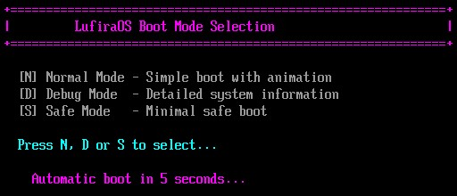
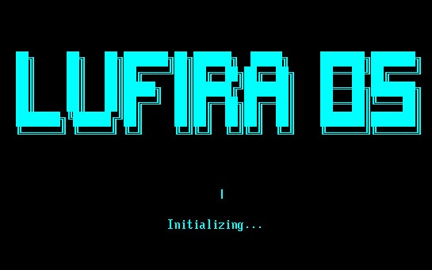
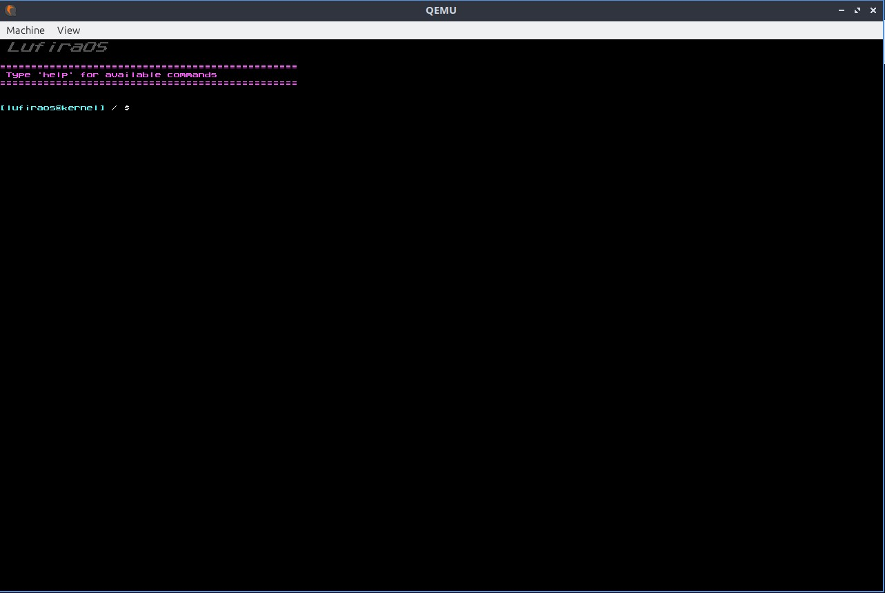
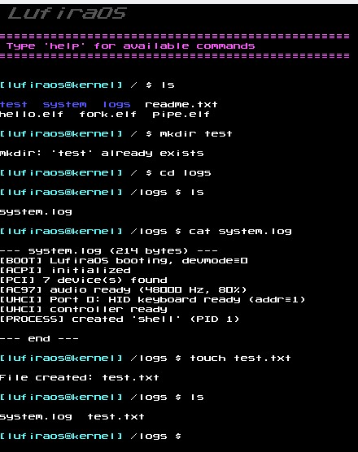
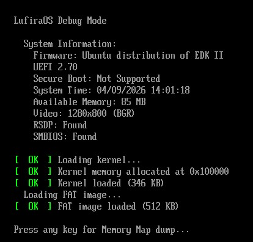
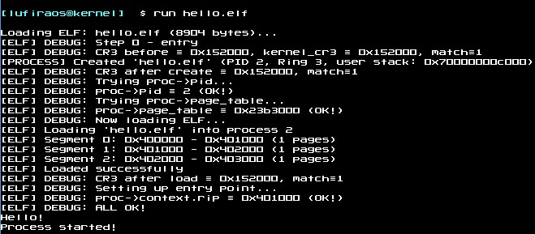

# LufiraOS


**LufiraOS** is a 64-bit hobby operating system for the x86_64 architecture, written from scratch in C and assembly by a single developer with some assistance from AI tools. It is designed to be educational, modular, and extensible, with a focus on understanding the core concepts of operating system development.

# 🚨 VERSION 0.1.0 (ALPHA) 🚨

> ## ⚠️ IMPORTANT NOTICE
> ### This is a **PRE-ALPHA** hobby operating system.
> ### It contains **MANY BUGS**, incomplete features, and rough edges.
> ### It is **NOT** intended for production use or daily driving.
> ### The system is a work in progress, and many features are either partially implemented or not yet functional.
> ### Use at your own risk, and expect crashes, instability, and missing functionality.

# ⚠️ Documentation Notice

> This documentation is provided for LufiraOS v0.1.0 and may contain inaccuracies, outdated information, or minor inconsistencies with the current source code. LufiraOS is an actively developed project, and its architecture and implementation may change over time.
>If a discrepancy exists between this documentation and the source code, the source code should be considered the authoritative reference.
> Documentation will be continuously reviewed and updated as the project evolves.

## System Requirements

| Component | Minimum Requirement |
|-----------|---------------------|
| **Architecture** | x86_64 (64-bit) |
| **RAM** | 64 MB |
| **Disk Space** | ~512 KB (kernel + bootloader) |
| **Firmware** | UEFI (BIOS/Legacy not supported) |
| **Display** | Any VESA/VBE-compatible framebuffer |
| **Audio (optional)** | AC'97 compatible audio controller |

**Note:** The system runs primarily in QEMU and may not work correctly on real hardware.

---

## Screenshots

### Bootloader Menu



### Kernel Boot Process



### Interactive Shell



### Filesystem Operations



### Debug Mode



### Running ELF Programs



## Table of Contents

1. [Overview](#overview)
2. [Screenshots](#screenshots)
3. [Features](#features)
4. [Architecture Overview](#architecture-overview)
5. [Getting Started](#getting-started)
   - [Prerequisites](#prerequisites)
   - [Building](#building)
   - [Running](#running)
6. [Documentation](#documentation)
7. [Project Structure](#project-structure)
8. [Known Issues and Limitations](#known-issues-and-limitations)
9. [Contributing](#contributing)
10. [License](#license)

---

## Overview

LufiraOS is a from-scratch operating system that boots via UEFI, features a graphical console, supports the FAT filesystem, and provides a multitasking environment with system calls and a user shell. It serves as a learning platform for OS development and a foundation for further experimentation.

### Key Concepts

- **Monolithic Kernel** – all core services (memory management, process scheduling, drivers) run in kernel space.
- **UEFI Boot** – boots on modern hardware using the UEFI firmware.
- **Graphical Console** – uses the framebuffer for text output with a custom 8×8 font and 256-color palette.
- **Cooperative Multitasking** – simple round-robin scheduler with process states (READY, RUNNING, BLOCKED, SLEEPING, TERMINATED).
- **ELF Executable Support** – loads and runs 64-bit ELF programs.
- **System Calls** – provides a controlled interface for user-mode programs.

---

## Features

### Bootloader

- UEFI application with three boot modes:
  - **Normal** – animated splash screen, fast boot.
  - **Debug** – detailed system information, memory map dumps, table listings.
  - **Safe** – minimal mode for troubleshooting.
- Gathers system information (memory map, framebuffer, ACPI/SMBIOS).
- Loads kernel and optional FAT image.

### Kernel

- **Memory Management**
  - Physical Memory Manager (PMM) with bitmap allocation.
  - 4-level paging (PML4, PDPT, PD, PT) with 2 MiB huge pages for identity mapping.
  - Kernel heap (16 MiB) with first-fit allocator.

- **Interrupt Handling**
  - GDT, IDT, and TSS for protected mode and user-mode transitions.
  - PIC remapping (IRQs 0–15 → vectors 32–47).
  - Exception handling with register dumps.

- **Process Management**
  - ELF loader (ET_EXEC and ET_DYN).
  - Process creation, scheduling, and termination.
  - Cooperative multitasking with timer ticks (100 Hz).
  - `syscall` instruction for fast system calls.

- **System Calls (17 implemented)**
  - File operations: `open`, `close`, `read`, `write`, `seek`.
  - Process control: `exit`, `getpid`, `sleep`, `kill`, `yield`.
  - System info: `gettick`.
  - Stubs for `mmap`, `exec`, `fork`, `wait`, and more.

- **Filesystem**
  - FAT12/16/32 driver with read/write support.
  - Virtual Filesystem (VFS) abstraction layer.
  - Dirty sector tracking and flushing.
  - Directory operations (`mkdir`, `rm`, `opendir`, `readdir`).

- **Drivers**
  - **Console** – graphical text output, 256-color palette, scrollback.
  - **Disk (ATA PIO)** – sector read/write for primary IDE channel.
  - **Keyboard (PS/2)** – scancode translation, modifiers, IRQ1.
  - **Mouse (PS/2)** – packet decoding, IRQ12.
  - **PCI** – bus enumeration, BAR management.
  - **AC’97 Audio** – mixer control, DMA playback, tone generation.

- **ACPI**
  - RSDP parsing (revision 1 and 2).
  - FADT detection and ACPI mode enabling.
  - System shutdown (S5 state).

- **Shell**
  - Command-line interface with line editing.
  - Command history (20 entries).
  - Tab completion (command names).
  - Built-in commands: system control, file management, process control, audio.
  - Current working directory (cwd) support.

---

## Architecture Overview

```svg

+--------------------------------------------------+
\| USER MODE |
\| +------------------------------------------+ |
\| | Shell / User Programs | |
\| | (ELF executables) | |
\| +------------------------------------------+ |
\| | |
\| syscall |
\| | |
+--------------------------------------------------+
\| KERNEL MODE |
\| +------------------------------------------+ |
\| | System Calls (17) | |
\| +------------------------------------------+ |
\| | VFS / FAT Driver | |
\| +------------------------------------------+ |
\| | Process Scheduler / ELF Loader | |
\| +------------------------------------------+ |
\| | Memory Management (PMM / Paging / Heap) | |
\| +------------------------------------------+ |
\| | Drivers (Console, Disk, Keyboard, | |
\| | Mouse, PCI, AC'97, ACPI) | |
\| +------------------------------------------+ |
\| | CPU / Interrupts (GDT, IDT, IRQ, TSS) | |
\| +------------------------------------------+ |
\| | |
+----------------------+-----------------------------+
|
UEFI Bootloader
|
BootInfo Structure

````
---

## Getting Started

### Prerequisites

- **GCC** (x86_64-elf or with cross-compile support)
- **GNU ld**, **objcopy**, **nm**
- **GNU-EFI** headers and libraries (`/usr/include/efi`, `/usr/lib`)
- **dosfstools** (`mkfs.fat`)
- **mtools** (`mmd`, `mcopy`)
- **QEMU** with OVMF firmware
- **make**

### Building

```bash
# Clone the repository
git clone https://github.com/yourusername/lufiraos.git
cd lufiraos

# Build everything and run
make clean && make run
````

### Running


``` bash
# Run in QEMU
make run

# Run with debug logging
make debug

# Run with QEMU monitor (telnet on port 4444)
make monitor

# Clean build artefacts
make clean
```

**QEMU Parameters:**

- OVMF UEFI firmware (`/usr/share/ovmf/OVMF.fd`)
- Disk image as IDE drive
- 128 MB RAM
- AC’97 audio (ALSA backend)
- Serial output redirected to stdio

---

## Documentation

Detailed documentation is available in the `documentation/` directory:

| **FileDescription**                                                        |                                                             |
| -------------------------------------------------------------------------- | ----------------------------------------------------------- |
| [`01_bootloader.md`](https://documentation/01_bootloader.md)               | UEFI bootloader, boot modes, BootInfo structure             |
| [`02_kernel_init.md`](https://documentation/02_kernel_init.md)             | Kernel entry point and initialization order                 |
| [`03_bootinfo.md`](https://documentation/03_bootinfo.md)                   | BootInfo structure reference                                |
| [`04_logging.md`](https://documentation/04_logging.md)                     | Logging macros (log.h)                                      |
| [`05_build_system.md`](https://documentation/05_build_system.md)           | Build system and QEMU usage                                 |
| [`06_libraries.md`](https://documentation/06_libraries.md)                 | System libraries (types, colors, string, etc.)              |
| [`07_drivers.md`](https://documentation/07_drivers.md)                     | Device drivers (console, disk, keyboard, mouse, PCI, AC'97) |
| [`08_filesystem.md`](https://documentation/08_filesystem.md)               | FAT driver and Virtual Filesystem (VFS)                     |
| [`09_acpi.md`](https://documentation/09_acpi.md)                           | ACPI subsystem (RSDP, FADT, shutdown)                       |
| [`10_cpu_interrupts.md`](https://documentation/10_cpu_interrupts.md)       | CPU, GDT, IDT, IRQ, TSS, PIT                                |
| [`11_memory_management.md`](https://documentation/11_memory_management.md) | PMM, Paging, Heap                                           |
| [`12_elf_processes.md`](https://documentation/12_elf_processes.md)         | ELF loader and process management                           |
| [`13_syscalls.md`](https://documentation/13_syscalls.md)                   | System calls (syscall instruction, table, handler)          |
| [`14_shell_commands.md`](https://documentation/14_shell_commands.md)       | Shell and built-in commands                                 |

---

## Project Structure

text

```
lufiraos/
├── boot/                      # UEFI bootloader sources
│   ├── boot.c                 # Entry point, menu, countdown
│   ├── boot_modes/            # Boot mode implementations
│   │   ├── quick_boot.c       # Normal mode
│   │   ├── debug_boot.c       # Debug mode
│   │   └── safe_boot.c        # Safe mode
│   ├── loaders/               # Loaders
│   │   ├── kernel_loader.c    # Kernel loader
│   │   └── fat_loader.c       # FAT image loader
│   ├── system/                # System services
│   │   ├── memory.c           # Memory map
│   │   ├── graphics.c         # Graphics initialization
│   │   ├── tables.c           # ACPI/SMBIOS tables
│   │   └── exit_boot.c        # ExitBootServices
│   ├── ui/                    # UI utilities
│   │   ├── splash.c           # Splash screen
│   │   └── utils.c            # Console helpers
│   └── bootinfo.h             # BootInfo structure
│
├── kernel/                    # Kernel sources
│   ├── kernel.c               # Entry point, initialization
│   ├── linker.ld              # Linker script
│   ├── drivers/               # Device drivers
│   │   ├── console/           # Console driver
│   │   ├── disk/              # ATA PIO driver
│   │   ├── keyboard/          # PS/2 keyboard driver
│   │   ├── mouse/             # PS/2 mouse driver
│   │   ├── pci/               # PCI bus driver
│   │   └── sound/             # AC'97 audio driver
│   ├── fs/                    # Filesystem
│   │   ├── fat/               # FAT driver
│   │   │   ├── fat.c          # FAT implementation
│   │   │   ├── fat_vfs.c      # VFS wrapper
│   │   │   └── fat.h          # FAT header
│   │   └── vfs/               # Virtual Filesystem
│   │       ├── vfs.c          # VFS core
│   │       └── vfs.h          # VFS header
│   ├── lib/                   # System libraries
│   │   ├── types.h            # Basic types
│   │   ├── colors.h           # Color definitions
│   │   ├── string.c/h         # String utilities
│   │   ├── cpu.c/h            # CPU utilities
│   │   └── stdarg.h           # Variable arguments
│   ├── shell/                 # Shell
│   │   ├── shell.c            # Shell core
│   │   ├── shell.h            # Shell header
│   │   └── commands/          # Built-in commands
│   │       ├── system.c       # System commands
│   │       ├── colors.c       # Color commands
│   │       ├── filesystem.c   # Filesystem commands
│   │       └── sound.c        # Audio commands
│   └── system/                # Kernel subsystems
│       ├── acpi/              # ACPI
│       ├── cpu/               # CPU management (GDT, IDT, IRQ, TSS)
│       ├── elf/               # ELF loader
│       ├── mm/                # Memory management (PMM, Paging, Heap)
│       ├── process/           # Process management
│       ├── syscall/           # System calls
│       └── timer/             # PIT timer
│
├── build/                     # Build artefacts (created by make)
│   ├── BOOTX64.EFI            # UEFI bootloader
│   ├── kernel.bin             # Kernel binary
│   ├── kernel.elf             # Kernel with debug symbols
│   └── disk.img               # Complete disk image
│
├── Makefile                   # Build system
├── README.md                  # This file
└── documentation/             # Documentation
    ├── 01_bootloader.md
    ├── 02_kernel_init.md
    └── ...
```

---

## Contributing

Contributions are welcome! Here are some areas for improvement:

- **Filesystem**: Long file name (LFN) support for FAT, additional filesystem drivers (ext2, ISO9660).
- **Drivers**: USB, AHCI/SATA, network, graphics acceleration.
- **Processes**: Preemptive multitasking, proper fork/exec/wait, IPC.
- **System Calls**: Implement stubs (mmap, exec, fork, wait, etc.).
- **Shell**: Pipes, redirection, environment variables, scripting.
- **Security**: Memory protection, user/kernel separation, paging permissions.
- **Documentation**: More examples, tutorials, API references.

### Guidelines

1. Follow the existing code style (K&R with 4-space indentation).
2. Keep functions modular and well-commented.
3. Update documentation when adding new features.
4. Test changes in QEMU before submitting.

---

## License

This project is licensed under the GPL-3.0 License. See the [LICENSE](LICENSE) file for details.

---

---

**LufiraOS** – Building an OS from scratch, one commit at a time.