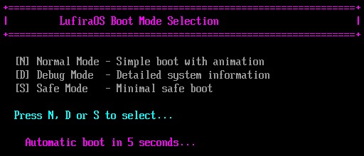
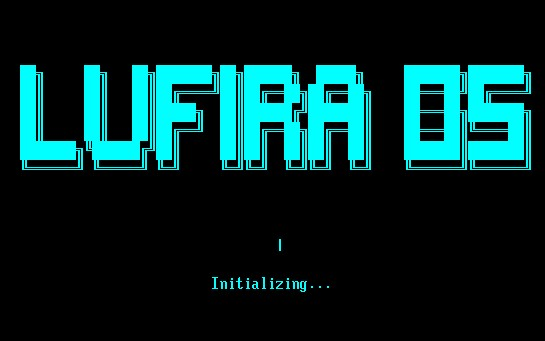
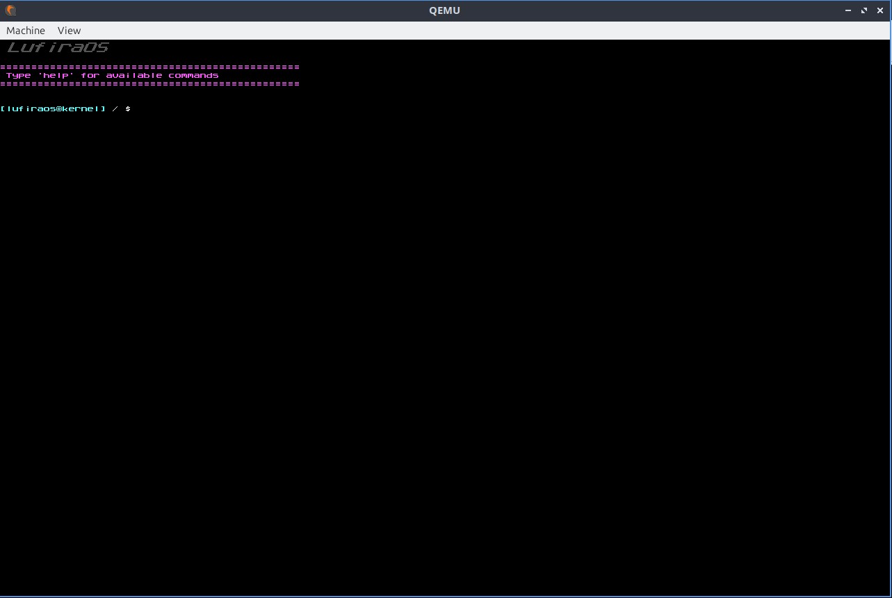
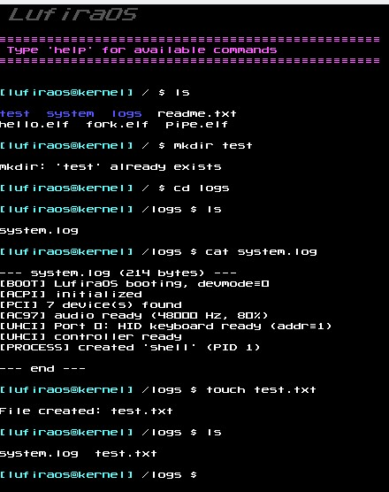
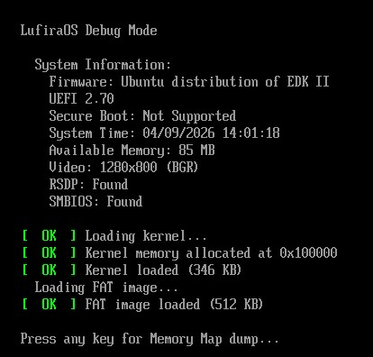
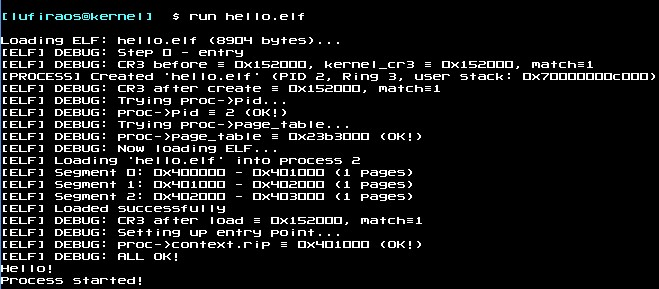

# LufiraOS


**LufiraOS** is a 64-bit hobby operating system for the x86_64 architecture, written from scratch in C and assembly by a single developer with some assistance from AI tools. It is designed to be educational, modular, and extensible, with a focus on understanding the core concepts of operating system development.

This repository is the kernel and UEFI bootloader. Everything that runs in userspace — the shell, coreutils, the package manager, the GUI and its apps — lives in a sibling repository, [lufira-packages](https://github.com/VLPLAY-Games/lufira-packages), built and staged onto a disk image by [LufiraOS-Builder](https://github.com/VLPLAY-Games/LufiraOS-Builder). Standalone syscall-level test programs live in [lufira-tests](https://github.com/VLPLAY-Games/lufira-tests).

# 🚨 VERSION 0.8.0 (ALPHA) 🚨

> ## ⚠️ IMPORTANT NOTICE
> ### This is a **PRE-ALPHA** hobby operating system.
> ### It contains **MANY BUGS**, incomplete features, and rough edges.
> ### It is **NOT** intended for production use or daily driving.
> ### The system is a work in progress, and many features are either partially implemented or not yet functional.
> ### Use at your own risk, and expect crashes, instability, and missing functionality.
> ### See [Known Issues and Limitations](#known-issues-and-limitations) for the most significant current problems.

# ⚠️ Documentation Notice

> This documentation is provided for LufiraOS v0.8.0 and may contain inaccuracies, outdated information, or minor inconsistencies with the current source code. LufiraOS is an actively developed project, and its architecture and implementation may change over time.
>If a discrepancy exists between this documentation and the source code, the source code should be considered the authoritative reference.
> Documentation will be continuously reviewed and updated as the project evolves. See [CHANGELOG.md](CHANGELOG.md) for a detailed history of changes.

## System Requirements

| Component | Minimum Requirement |
|-----------|---------------------|
| **Architecture** | x86_64 (64-bit) |
| **RAM** | 64 MB |
| **Disk Space** | 16 MB (fixed-size disk image: FAT12 ESP + LufiraFS region) |
| **Firmware** | UEFI (BIOS/Legacy not supported) |
| **Display** | Any VESA/VBE-compatible framebuffer |
| **Audio (optional)** | AC'97 compatible audio controller |
| **Network (optional)** | RTL8139-compatible Ethernet, for the package manager and `wget`/`ping` |

**Note:** The system runs primarily in QEMU and may not work correctly on real hardware.

---

## Screenshots

### Bootloader Menu



### Kernel Boot Process



### Interactive Shell



### Filesystem Operations



### Debug Mode



### Running ELF Programs



## Table of Contents

1. [Overview](#overview)
2. [Screenshots](#screenshots)
3. [Features](#features)
4. [Architecture Overview](#architecture-overview)
5. [Getting Started](#getting-started)
   - [Prerequisites](#prerequisites)
   - [Building](#building)
   - [Running](#running)
6. [Documentation](#documentation)
7. [Project Structure](#project-structure)
8. [Known Issues and Limitations](#known-issues-and-limitations)
9. [Contributing](#contributing)
10. [License](#license)

---

## Overview

LufiraOS is a from-scratch operating system that boots via UEFI, features a graphical console and a userspace GUI, uses its own **LufiraFS** filesystem, and provides a preemptive multitasking environment with system calls, a minimal dynamically-linked C library, user accounts/permissions, USB (xHCI) input and mass storage, a real network stack (DNS/TCP/TLS/HTTPS), and a package manager. Essentially everything that can run in ring 3 — the shell, coreutils, the window manager, GUI apps — does; this repository's kernel binary now ships only drivers and core subsystems.

### Key Concepts

- **Monolithic Kernel** – core services (memory management, process scheduling, drivers, filesystem, networking) run in kernel space; everything else is an ordinary userspace ELF.
- **UEFI Boot** – boots on modern hardware using the UEFI firmware.
- **Graphical Console** – framebuffer text output with a custom 8×8 font, 256-color palette, and a scaled/tilted big-text renderer for the boot logo; replaced by the GUI once a window manager registers.
- **Preemptive Multitasking** – the timer (100 Hz) preempts ring-3 code on a fixed timeslice, so a process that never yields can't stall the system; process states are READY, RUNNING, BLOCKED, SLEEPING, STOPPED, TERMINATED, with `fork()`/`exec()`/`wait()` and POSIX-style signals.
- **Virtual Memory** – `mmap()`/`munmap()` (anonymous, eager-allocated) back the minimal libc's `malloc()`.
- **ELF Executable Support** – loads and runs 64-bit ELF programs (ET_EXEC and ET_DYN) with real `argv`/`envp`; ET_DYN packages share one dynamically-linked `libc.so` instead of a static copy each.
- **System Calls** – 65 syscalls with user-pointer validation and errno-style error codes, covering files, processes, memory, users, USB, signals, a GUI/windowing surface, generic IPC, and networking.
- **Mailbox IPC** – a generic per-process message mailbox (`SYS_IPC_SEND`/`RECV`), not GUI-specific; the window manager's own client protocol is built on top of it in userspace.
- **Users & Permissions** – Unix-like `uid`/`gid`/9-bit permission model with persistent accounts (`/etc/passwd`, `/etc/group`).
- **Package Manager** – `.lpg` packages, installed/updated/removed by `dlpg`, which can also sync and upgrade straight from a GitHub-hosted index over HTTPS.
- **Developer Mode** – a persistent on-disk flag that switches between a quiet boot (with a logo) and a fully verbose diagnostic log; see [`04_logging.md`](documentation/04_logging.md).

---

## Features

### Bootloader

- UEFI application with three boot modes:
  - **Normal** – animated splash screen, fast boot.
  - **Debug** – detailed system information, memory map dumps, table listings.
  - **Safe** – minimal mode for troubleshooting.
- Gathers system information (memory map, framebuffer, ACPI/SMBIOS).
- Loads the kernel and the raw disk image (FAT12 ESP + LufiraFS region — see `documentation/08_filesystem.md`).

### Kernel

- **Memory Management**
  - Physical Memory Manager (PMM) with bitmap allocation.
  - 4-level paging (PML4, PDPT, PD, PT) with 2 MiB huge pages for identity mapping.
  - Kernel heap (16 MiB) with first-fit allocator.

- **Interrupt Handling**
  - GDT, IDT, and TSS for protected mode and user-mode transitions.
  - PIC remapping (IRQs 0–15 → vectors 32–47).
  - Exception handling with register dumps.

- **Process Management**
  - ELF loader (ET_EXEC and ET_DYN, dynamic linking against a shared `libc.so`).
  - Process creation, scheduling, and termination, with real teardown (page tables, ring-0 stacks, and open file descriptors are freed on exit; orphaned background processes are reaped automatically).
  - **Preemptive** multitasking: the timer (100 Hz) preempts ring-3 code on a fixed timeslice; every process is guaranteed to actually reach ring 3, even one that never calls a syscall.
  - `fork()`, in-place `exec()` with real `argv`/`envp`, `wait()`, and POSIX-style signals (`SIGTERM`, `SIGKILL`, `SIGSTOP`, `SIGCONT`) via `kill`.
  - Anonymous pipes, and a generic per-process mailbox for message-based IPC (`SYS_IPC_SEND`/`RECV`).
  - `syscall` instruction for fast system calls.

- **Virtual Memory**
  - `mmap()`/`munmap()` — anonymous, eager-allocated, per-process region tracking, `PROT_READ`/`PROT_WRITE`/`PROT_EXEC` enforced via the NX bit.

- **System Calls (65 implemented)**
  - File operations: `open`, `close`, `read`, `write`, `seek`, `pipe`, `dup2`, `mkdir`, `rmdir`, `unlink`, `readdir`.
  - Process control: `exit`, `getpid`, `sleep`, `kill`, `yield`, `fork`, `exec`, `wait`, signals (`sigaction`, `sigreturn`, `alarm`), foreground tracking.
  - Memory: `mmap`, `munmap`.
  - Filesystem/identity: `getcwd`, `chdir`, `chmod`, `chown`, `getuid`, `getgid`, `statfs`.
  - Users/system: `su`, `mount`/`unmount`, `reboot`, `shutdown`, `devmode`, `useradd`, `groupadd`, `passwd`, `meminfo`, `cpuload`, `pslist`.
  - USB: device count/info/read/write.
  - GUI/windowing: window create/destroy/fill/draw/poll-event/move, framebuffer info/present/font, WM registration.
  - IPC: generic mailbox send/receive.
  - Networking: `SYS_NET_FETCH` — resolve, connect (TCP or TLS), send an HTTP(S) request, and return the parsed response body in one call.
  - Every syscall that dereferences a user pointer validates it first; failures return errno-style codes (`EFAULT`, `EINVAL`, `ENOENT`, `ENOTDIR`, `ERANGE`, `EPERM`, `EACCES`, …) instead of a bare `-1`.

- **Minimal Userspace libc** (`libc/`)
  - `crt0.S` startup (`int main(int argc, char **argv, char **envp)`), thin syscall wrappers.
  - Dynamically linked as a shared `libc.so`, cached by the kernel after first load — packages no longer each carry a static copy.
  - Arena-based `malloc`/`free` built on `mmap`.
  - A `string.h` subset and a small `printf` (`%d %u %x %s %c %p %l*`).

- **Users, Groups & Permissions**
  - Unix-like `uid`/`gid`/9-bit permission model enforced on every file/directory operation; root (`uid` 0) bypasses all checks.
  - Persistent `/etc/passwd` and `/etc/group` (salted FNV-1a password hashing); `whoami`, `chmod`, `chown`, `useradd`, `groupadd`, `su`.
  - Boots straight into a root shell — no login prompt.

- **Filesystem — LufiraFS**
  - Custom filesystem (superblock, block bitmap, fixed inode table, real `.`/`..` directory entries, per-inode owner/group/permission bits) that replaces FAT as the primary storage backend.
  - A small FAT12 partition (the UEFI ESP) still holds only the bootloader and kernel binary, since UEFI firmware can only read FAT — everything else lives on LufiraFS.
  - Virtual Filesystem (VFS) abstraction layer; shell filesystem commands and syscalls go through the same `vfs_*_at()` call layer instead of duplicating LufiraFS logic.
  - Dirty block tracking and flushing back to disk.
  - Full path resolution (multi-level directories, per-process cwd) and directory operations (`mkdir`, `rm`, `opendir`, `readdir`).
  - Host-side `mkfs_lufirafs` tool for formatting/populating the disk image at build time.
  - **FAT driver** (`kernel/fs/fat/`) — `mount`/`unmount` a USB flash drive's FAT12/16/32 filesystem (read/write) under a path prefix (e.g. `/mnt/usb0`), wired straight into the VFS: ordinary `open`/`read`/`write`/`mkdir`/`unlink`/`readdir`/`cat`/`cp`/`ls`/`rm` work on it directly, no separate mount-specific commands needed. Root-directory-only per mount (no subdirectory traversal on the flash drive yet) and the whole device image is read into RAM up front.

- **Networking**
  - **Ethernet/ARP/IPv4/ICMP/TCP** — a polled (no interrupts) stack over an RTL8139 driver; TCP does stop-and-wait retransmission and a real advertised receive window (no congestion control).
  - **UDP + DNS** — a minimal resolver for turning hostnames into IPv4 addresses, so networking no longer requires literal IPs.
  - **TLS 1.2, from scratch** — ECDHE key exchange over X25519, AES-128-GCM records, SNI, and RSA signature verification of the server's ServerKeyExchange against its own certificate. **No certificate chain / root CA validation** — see [Known Issues](#known-issues-and-limitations).
  - **An HTTP(S) client and `SYS_NET_FETCH` syscall** — one blocking call resolves, connects, requests, and returns a parsed response body to userspace; the package manager's `dlpg sync`/`upgrade` are its first real use.

- **Package Manager**
  - `.lpg` package format (header, dependency table, file table) and `dlpg` — install/update/list/remove, with dependency version checks and `/etc/packages/` bookkeeping.
  - `dlpg sync`/`dlpg upgrade` fetch the current package index and newer packages straight from a GitHub-hosted repository over HTTPS.
  - See [lufira-packages](https://github.com/VLPLAY-Games/lufira-packages) for the actual package sources and the index.

- **GUI + Window Manager**
  - A generic mailbox IPC primitive plus a GUI syscall surface (window create/destroy/fill/draw/poll-event/move, framebuffer present) — the window manager itself is an ordinary userspace process, not kernel code, registered once via `SYS_WM_REGISTER`.
  - Z-ordering, drag, resize/maximize/minimize, a taskbar with a Start menu (Exit GUI/Shutdown/Reboot), desktop launcher icons, dirty-rectangle compositing for responsive cursor movement.
  - GUI apps (terminal — wraps a real shell behind pipes, notepad, a file manager, a calculator, system info) in `lufira-packages`.

- **Drivers**
  - **Console** – graphical text output, 256-color palette, scrollback, scaled/tilted big-text rendering (boot logo, shell watermark).
  - **Disk (ATA PIO)** – sector read/write for primary IDE channel.
  - **Keyboard (PS/2)** – scancode translation, modifiers, IRQ1.
  - **Mouse (PS/2)** – packet decoding, IRQ12.
  - **USB (xHCI)** – full command/event/transfer-ring host-controller driver, with a HID boot-protocol keyboard/mouse driver and USB Mass Storage (Bulk-Only Transport) support, unified with PS/2 through a common input dispatcher.
  - **Network (RTL8139)** – Ethernet driver under the full stack described above.
  - **PCI** – bus enumeration, BAR management.
  - **AC'97 Audio** – mixer control, DMA playback, tone generation.

- **ACPI**
  - RSDP parsing (revision 1 and 2).
  - FADT detection and ACPI mode enabling.
  - System shutdown (S5 state).

- **Developer Mode & Logging**
  - Persistent on-disk flag (`/system/devmode.flag`) toggled with the `devmode` command, gating verbose boot/driver diagnostics.
  - Lightweight `klog` logger writes short status lines to `/logs/system.log` regardless of developer mode.

- **Shell** — now a real userspace process (`lufira-packages/shell/shell.c`), not kernel code
  - Line editing, command history, `cd`/`pwd`/`su`/`mount`/`unmount` builtins; everything else is `fork`+`exec`+`wait` against `/bin`.
  - File management, process control, users/permissions, USB mass storage, networking (`ifconfig`, `ping`, `wget`), the package manager (`dlpg`), and more — see [lufira-packages](https://github.com/VLPLAY-Games/lufira-packages) for the current command set.
  - Current working directory (cwd) is per-process, not shell-global.

---

## Architecture Overview

```svg

+--------------------------------------------------+
\| USER MODE |
\| +------------------------------------------+ |
\| | Shell / GUI / Packages (lufira-packages) | |
\| | (dynamically-linked ELF executables) | |
\| +------------------------------------------+ |
\| | |
\| syscall |
\| | |
+--------------------------------------------------+
\| KERNEL MODE |
\| +------------------------------------------+ |
\| | System Calls (65) | |
\| +------------------------------------------+ |
\| | VFS / LufiraFS Driver / Users&Perms | |
\| +------------------------------------------+ |
\| | GUI Syscalls (Win/FB) / Mailbox IPC | |
\| +------------------------------------------+ |
\| | Process Scheduler / ELF Loader | |
\| | (preemptive, fork / exec / wait / pipes) | |
\| +------------------------------------------+ |
\| | Memory Management (PMM / Paging / Heap / | |
\| | mmap) | |
\| +------------------------------------------+ |
\| | Network Stack (Eth/ARP/IP/ICMP/TCP/UDP/ | |
\| | DNS/TLS 1.2/HTTP(S)) | |
\| +------------------------------------------+ |
\| | Drivers (Console, Disk, Keyboard, Mouse, | |
\| | USB/xHCI+MSD, RTL8139/Net, PCI, AC'97, | |
\| | ACPI) | |
\| +------------------------------------------+ |
\| | Devmode / klog | |
\| +------------------------------------------+ |
\| | CPU / Interrupts (GDT, IDT, IRQ, TSS) | |
\| +------------------------------------------+ |
\| | |
+----------------------+-----------------------------+
|
UEFI Bootloader
|
BootInfo Structure

````
---

## Getting Started

### Prerequisites

- **GCC** (x86_64-elf or with cross-compile support)
- **GNU ld**, **objcopy**, **nm**
- **GNU-EFI** headers and libraries (`/usr/include/efi`, `/usr/lib`)
- **dosfstools** (`mkfs.fat`)
- **mtools** (`mmd`, `mcopy`)
- **QEMU** with OVMF firmware
- **make**
- **Python 3**, for [LufiraOS-Builder](https://github.com/VLPLAY-Games/LufiraOS-Builder) (disk image assembly and running QEMU — see below)

### Building

This repository's own `Makefile` now builds only the kernel and bootloader:

```bash
git clone https://github.com/VLPLAY-Games/LufiraOS.git
cd LufiraOS
make kernel bootloader
````

Assembling a bootable disk image (staging the package manager's packages, the shell, etc.) and running it is [LufiraOS-Builder](https://github.com/VLPLAY-Games/LufiraOS-Builder)'s job — it needs nothing more than this repository checked out somewhere `LufiraOS-Builder` can find it:

```bash
git clone https://github.com/VLPLAY-Games/LufiraOS-Builder.git
cd LufiraOS-Builder
python3 build.py run   # builds this kernel too if needed, assembles disk.img, launches QEMU
```

### Running

`LufiraOS-Builder`'s `build.py` replaces the old all-in-one Makefile `run`/`debug`/`monitor` targets:

```bash
python3 build.py run       # quiet boot, boot logo, developer mode off
python3 build.py debug     # developer mode on, plus /tests and a USB stick
python3 build.py monitor   # same as run, with the QEMU HMP monitor (telnet on port 4444)
python3 build.py build     # just assemble disk.img, don't launch QEMU
python3 build.py clear     # remove all build output for a from-scratch rebuild
```

This repository's own `make clean` still removes just this repository's build artifacts (`kernel.bin`, `BOOTX64.EFI`, object files).

**QEMU Parameters** (as launched by `LufiraOS-Builder`):

- OVMF UEFI firmware (`/usr/share/ovmf/OVMF.fd`)
- Disk image as IDE drive
- KVM acceleration when available (`-machine pc,accel=kvm:tcg`), software emulation otherwise
- 256 MB RAM, AC'97 audio (ALSA backend), RTL8139 NIC via QEMU user-mode networking
- Serial output redirected to stdio

---

## Documentation

Detailed documentation is available in the `documentation/` directory:

| **File** | **Description** |
| -------------------------------------------------------------------------- | ----------------------------------------------------------- |
| [`01_bootloader.md`](documentation/01_bootloader.md)               | UEFI bootloader, boot modes, BootInfo structure             |
| [`02_kernel_init.md`](documentation/02_kernel_init.md)             | Kernel entry point and initialization order                 |
| [`03_bootinfo.md`](documentation/03_bootinfo.md)                   | BootInfo structure reference                                |
| [`04_logging.md`](documentation/04_logging.md)                     | Logging macros (log.h), developer mode, and `klog`          |
| [`05_build_system.md`](documentation/05_build_system.md)           | This repository's build (kernel + bootloader only) — see `LufiraOS-Builder` for image assembly/QEMU |
| [`06_libraries.md`](documentation/06_libraries.md)                 | System libraries (types, colors, string, etc.) and the shared `libc.so` |
| [`07_drivers.md`](documentation/07_drivers.md)                     | Device drivers (console, disk, keyboard, mouse, USB/xHCI + Mass Storage, RTL8139, PCI, AC'97) |
| [`08_filesystem.md`](documentation/08_filesystem.md)               | LufiraFS driver, Virtual Filesystem (VFS), FAT/USB mounting  |
| [`09_acpi.md`](documentation/09_acpi.md)                           | ACPI subsystem (RSDP, FADT, shutdown)                       |
| [`10_cpu_interrupts.md`](documentation/10_cpu_interrupts.md)       | CPU, GDT, IDT, IRQ, TSS, PIT, preemptive scheduling          |
| [`11_memory_management.md`](documentation/11_memory_management.md) | PMM, Paging, Heap, `mmap`/`munmap`                           |
| [`12_elf_processes.md`](documentation/12_elf_processes.md)         | ELF loader, dynamic linking, and process management          |
| [`13_syscalls.md`](documentation/13_syscalls.md)                   | All 65 system calls, by category                             |
| [`14_shell_commands.md`](documentation/14_shell_commands.md)       | The (now userspace) shell and its commands                   |
| [`15_users_permissions.md`](documentation/15_users_permissions.md) | Users, groups, and file permissions                          |
| [`16_networking.md`](documentation/16_networking.md)               | Network stack: Ethernet/ARP/IP/ICMP/TCP/UDP/DNS/TLS 1.2/HTTP(S) |
| [`17_package_manager.md`](documentation/17_package_manager.md)     | `.lpg` format, `dlpg`, `sync`/`upgrade`                       |
| [`18_gui_wm.md`](documentation/18_gui_wm.md)                       | Mailbox IPC, the GUI syscall surface, the WM client protocol  |

---

## Project Structure

text

```
LufiraOS/
├── boot/                      # UEFI bootloader sources
│   ├── boot.c                 # Entry point, menu, countdown
│   ├── boot_modes/            # Boot mode implementations
│   │   ├── quick_boot.c       # Normal mode
│   │   ├── debug_boot.c       # Debug mode
│   │   └── safe_boot.c        # Safe mode
│   ├── loaders/               # Loaders
│   │   ├── kernel_loader.c    # Kernel loader
│   │   └── fat_loader.c       # FAT image loader
│   ├── system/                # System services
│   │   ├── memory.c           # Memory map
│   │   ├── graphics.c         # Graphics initialization
│   │   ├── tables.c           # ACPI/SMBIOS tables
│   │   └── exit_boot.c        # ExitBootServices
│   ├── ui/                    # UI utilities
│   │   ├── splash.c           # Splash screen
│   │   └── utils.c            # Console helpers
│   └── bootinfo.h             # BootInfo structure
│
├── kernel/                    # Kernel sources
│   ├── kernel.c               # Entry point, initialization
│   ├── linker.ld              # Linker script
│   ├── drivers/               # Device drivers
│   │   ├── console/           # Console driver
│   │   ├── disk/              # ATA PIO driver
│   │   ├── keyboard/          # PS/2 keyboard driver
│   │   ├── mouse/             # PS/2 mouse driver
│   │   ├── usb/               # xHCI host controller + USB HID + Mass Storage driver
│   │   ├── net/                # RTL8139 Ethernet driver
│   │   ├── input/             # Shared PS/2 + USB HID input dispatcher (also feeds the WM)
│   │   ├── pci/                # PCI bus driver
│   │   └── sound/             # AC'97 audio driver
│   ├── fs/                    # Filesystem
│   │   ├── lufirafs/          # LufiraFS driver (primary filesystem)
│   │   │   ├── lufirafs.c            # Core implementation
│   │   │   ├── lufirafs_vfs.c        # VFS wrapper
│   │   │   ├── lufirafs.h            # Driver API
│   │   │   └── lufirafs_format.h     # On-disk format (shared with mkfs_lufirafs)
│   │   ├── fat/                # FAT driver, used by mount/unmount for USB drives
│   │   └── vfs/                # Virtual Filesystem
│   │       ├── vfs.c          # VFS core
│   │       └── vfs.h          # VFS header
│   ├── net/                    # Ethernet/ARP/IP/ICMP/TCP/UDP/DNS/TLS/HTTP(S) stack
│   │   └── crypto/             # From-scratch SHA-256, HMAC, AES-128-GCM, X25519, bignum/RSA
│   ├── lib/                   # System libraries
│   │   ├── types.h            # Basic types
│   │   ├── colors.h           # Color definitions
│   │   ├── string.c/h         # String utilities
│   │   ├── cpu.c/h            # CPU utilities
│   │   └── stdarg.h           # Variable arguments
│   ├── shell/                 # Legacy kernel-native shell (not used — see lufira-packages)
│   └── system/                # Kernel subsystems
│       ├── acpi/              # ACPI
│       ├── cpu/                # CPU management (GDT, IDT, IRQ, TSS)
│       ├── devmode/            # Developer-mode flag (persistent, gates DLOG)
│       ├── klog/                # Persistent event logging (/logs/system.log)
│       ├── elf/                 # ELF loader + dynamic linking
│       ├── ipc/                 # Generic per-process mailbox IPC
│       ├── mm/                  # Memory management (PMM, Paging, Heap, mmap)
│       ├── process/             # Process management (preemptive, fork/exec/signals)
│       ├── syscall/             # System calls (65), including the GUI/FB and net surface
│       ├── users/               # User/group database (/etc/passwd, /etc/group)
│       └── timer/               # PIT timer, preemption timeslice
│
├── libc/                      # Minimal userspace C library (built as a shared libc.so)
│   ├── crt0.S                 # Startup code (_start -> main(argc, argv, envp))
│   ├── include/                # lufira/syscall.h, string.h, stdlib.h, stdio.h
│   └── src/                   # malloc.c, printf.c, string.c
│
├── tools/                     # Host-side build tools
│   ├── mkfs_lufirafs.c        # LufiraFS formatting/populating tool
│   ├── lpg_format.h           # .lpg package format (shared with lufira-packages)
│   └── seed/                  # Seeded /etc/passwd, /etc/group content
│
├── build/                     # Build artefacts (created by make) — kernel.bin/BOOTX64.EFI only;
│                               # disk.img is assembled by LufiraOS-Builder, not this repository
│
├── Makefile                   # Build system (kernel + bootloader only)
├── README.md                  # This file
├── CHANGELOG.md               # Version history
└── documentation/             # Documentation
    ├── 01_bootloader.md
    ├── 02_kernel_init.md
    └── ...
```

---

## Known Issues and Limitations

- **TLS has no certificate chain validation.** The from-scratch TLS 1.2 client verifies the server actually controls the key in the certificate it presents, but does not check that certificate against any trusted root CA — fine against a naive on-path attacker, not against one who can present their own certificate. No hardware RNG either, so no real forward secrecy. See `documentation/16_networking.md`.
- **`SYS_NET_FETCH` stalls the whole system for the duration of a fetch** — the same synchronous model `wget` always had; a large download blocks every other process until it completes or times out.
- **No DHCP.** Static IP configuration plus QEMU SLIRP's built-in DNS forwarder only.
- **`mount` reads the whole USB device into RAM up front** (capped at 8 MB) — no lazy/streaming FAT access, and only the root directory of a mounted drive is reachable (no subdirectory traversal yet) — see [`08_filesystem.md`](documentation/08_filesystem.md).
- **No memory protection beyond paging permissions and mmap's own bookkeeping.** `mmap` is anonymous-only, eagerly allocated, and never reclaims address space after `munmap`.
- **No setuid/setgid, no multi-group membership, and a non-cryptographic password hash.** The users/permissions model is a straightforward `uid`/`gid`/9-bit implementation, not a hardened one — see [`15_users_permissions.md`](documentation/15_users_permissions.md).
- **Real hardware is untested.** The system is developed and tested exclusively in QEMU; UEFI/ACPI/USB quirks on real firmware are unknown.
- See [CHANGELOG.md](CHANGELOG.md) for issues fixed in past versions.

---

## Contributing

Contributions are welcome! Here are some areas for improvement:

- **Filesystem**: Long file name (LFN) support, additional filesystem drivers (ext2, ISO9660), LufiraFS indirect-block-chain growth beyond a single indirect block, subdirectory traversal on a mounted USB drive (currently root-directory-only).
- **Drivers**: AHCI/SATA, graphics acceleration, multi-block USB Mass Storage transfers.
- **Networking**: DHCP, TLS certificate chain/root-CA validation, a real entropy source, TCP congestion control.
- **Processes**: Copy-on-write address spaces, demand-paged `mmap`.
- **Security**: setuid/setgid, cryptographically sound password hashing, VFS-level permission enforcement (currently caller-enforced, not VFS-enforced).
- **Shell**: Redirection, environment variables, scripting (see `lufira-packages`).
- **GUI**: More widgets, window-position persistence across sessions, additional apps (see `lufira-packages`).
- **Documentation**: More examples, tutorials, API references.

### Guidelines

1. Follow the existing code style (K&R with 4-space indentation).
2. Keep functions modular; comment the non-obvious *why*, not the obvious *what*.
3. Update documentation when adding new features.
4. Test changes in QEMU before submitting.

---

## License

This project is licensed under the GPL-3.0 License. See the [LICENSE](LICENSE) file for details.

---

---

**LufiraOS** – Building an OS from scratch, one commit at a time.
